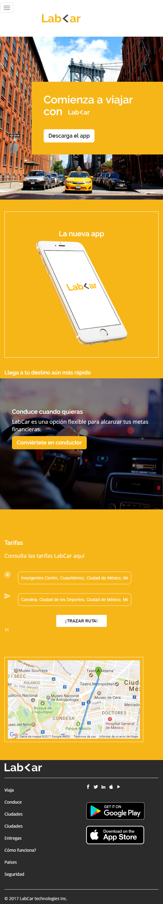

# RETO 1: Lab<ar

* **Curso:** _Responsive web Design_
* **Unidad 2:** _No repitas la rueda_
* **Tema** _Reto N° 1 -USO DE BOOTSTRAP_ 

***
## OBJETIVO
* Recrea la siguiente página web con el diseño de tu preferencia, que sea responsive.

## Flujo de trabajo
* Creamos la página utilizando Bootstrap, media query, media type y operadores lógicos para hacer responsive junto al diseño css. 
 
## Herramientas utilizadas

* HTML 5
* CSS 3
* Bootstrap

## PRODUCTO FINAL

#### VERSIÓN WEB 

* Vista desde la ventana del navegador desktop a medida se haga más pequeña.

#### VERSIÓN MOVIL

* Vista desde la ventana del navegador móvil a medida se haga más pequeña.

#### MODALES

* Modal de Inicia Sesión

* Modal de Regístrate

* Y modal de Convierte en conductor 

